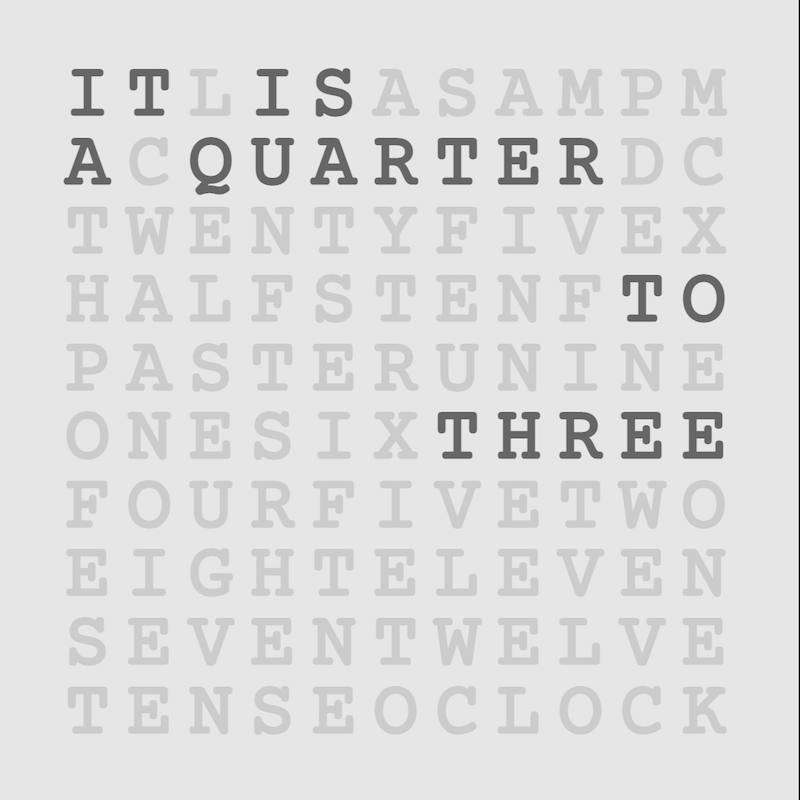

# Qlock

_A new clock, running on the [station-clock](https://github.com/pikesley/station-clock) hardware_



The Model-A Pi was really struggling with the demands of the [Station Clock](https://github.com/pikesley/station-clock), so I was looking around for something less demanding and I stumbled across [Carson Farmer's text-based clock](http://bl.ocks.org/carsonfarmer/a60c1ffa72bf58934bbd). That's all done using [d3.js](https://d3js.org/), but thinking about it, I realised that I should be able to reimplement it with HTML, CSS and some JavaScript.

If you just want to see it in action, then:

```bash
git clone https://github.com/pikesley/qlock
cd qlock
make build
make docker-compose
```

then in a different terminal:

```bash
make run
```

and it should be running at [http://localhost:8000/](http://localhost:8000/). Click on it anywhere to cycle through the available stylesheets.

The clock is perforce a bit vague, and I currently have it running with a 2-minute offset, so it will display e.g. `IT IS A QUARTER TO FOUR` from `15:43` to `15:48`, whereupon it changes to `TEN TO FOUR` for the following five minutes. I'm not sure if this is good, maybe it should be a 1-minute offset, so `15:44` to `15:49`.

To actually get it running on the Pi with the [HyperPixel](https://shop.pimoroni.com/products/hyperpixel-4-square?variant=30138251444307):

## Software

This was all done on a pristine install of Raspberry Pi OS Lite (i.e. no desktop) via [NOOBS 3.5](https://www.raspberrypi.org/downloads/noobs/).

You'll need to use a proper screen for the install because the Hyperpixel won't work until you've installed the drivers.

After the first boot, you need to enable SSH:

```bash
sudo raspi-config nonint do_ssh 0
```

Once you've done this you should be able to get to the Pi with

```bash
ssh pi@raspberrypi.local
```

(Optionally) change the hostname:

```bash
sudo raspi-config nonint do_hostname qlock
sudo reboot
```

Presuming this works, power it off, and attach the Hyperpixel (or move the card to the Pi which has the Hyperpixel on it). When you boot it, the screen won't work, but we'll fix that in a minute.

### Install the screen drivers

SSH onto the Pi, and then, per [this](https://github.com/pimoroni/hyperpixel4):

```bash
curl https://get.pimoroni.com/hyperpixel4 | bash
```

Select the correct screen and Pi combination (in my case it's `3 : Weirdly Square - Pi 3B+ or older`) and let it do its thing. When it's done it will reboot, and the screen should work. Now

### Clone this repo

```bash
git clone https://github.com/pikesley/qlock
```

### And configure everything

```bash
make setup
```

## Development

This was all developed on a Docker container. To run it:

```bash
git clone https://github.com/pikesley/qlock
cd qlock
make build
make docker-compose
```

then in a different terminal:

```bash
make run
```

The container starts `nginx` when you connect to it, so it should be running at [http://localhost:8080/](http://localhost:8080/).

### Tests

There are some [Jasmine](https://jasmine.github.io/) [JavaScript tests](spec/javascripts). To run them, do

```bash
make jasmine
```

and they should be running at [http://localhost:8888/](http://localhost:8888/).

There are also some [Nightwatch](https://nightwatchjs.org/) [tests](spec/javascripts/nightwatch/qlock-tests.js). Run these with:

```bash
make nightwatch-tests
```

These tests run against a [Selenium](https://www.selenium.dev/) server started when you ran `make docker-compose`.

Or to run all the tests together (with the Jasmine tests running in a headless browser):

```bash
make test
```

### Designs

The designs are built using [Dart SASS](https://sass-lang.com/dart-sass). Each `.scss` file in the root of [clock/sass](clock/sass) becomes part of the list of designs that are cycled-through when the screen is clicked, and they have a very particular layout:

```css
$white: rgb(255, 255, 255); // define some colours

$background-colour: darken($white, 10%);
$active-colour: darken($white, 60%);
$inactive-colour: darken($white, 20%);

@mixin activated {  // these two mixins will be applied when the text is faded in or out
    color: $active-colour;
}

@mixin deactivated {
    color: $inactive-colour;
}

@import 'base/faders';  // this contains the fade-in and -out animations

body {  // add additional body styles here
    background-color: $background-colour;
    font-weight: bold;
    font-size: 4.9em;
}
```

You need to run

```bash
make sass
```

to get the designs building. Note that this is probably a terrible misuse of SASS, it's really not my area of expertise.

### Push changes to the Pi

As long as `PIHOST` at the top of the [Makefile](Makefile) resolves to the address of your Pi, you should ba able to push new code to it with:

```bash
cd ../
make push-code
```

On the Pi, you can force the browser to reload with

```bash
DISPLAY=:0 xdotool key F5
```

or generate a fake click to cycle through the designs with

```bash
DISPLAY=:0 xdotool click 1
```

## Next steps

I've just bought an old square monitor off eBay to make a full-size clock, pictures soon I guess.
