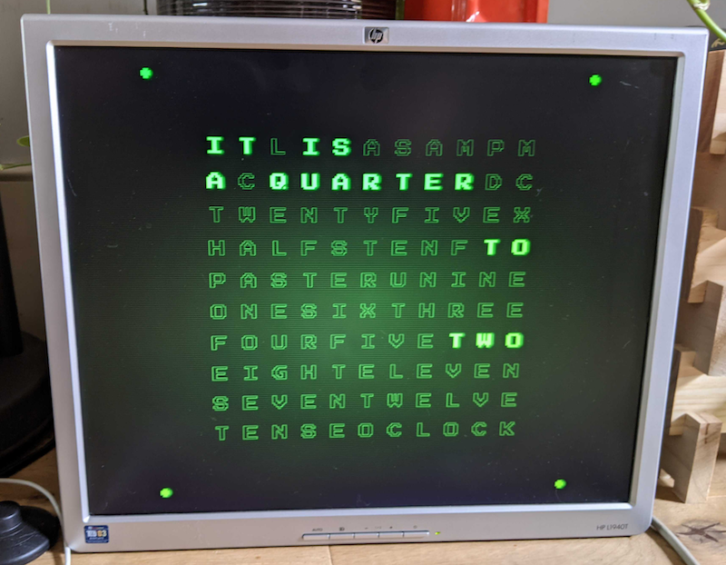

[](https://github.com/pikesley/jlock/actions/workflows/main.yml)

# Jlock

https://user-images.githubusercontent.com/885973/142761936-de1c8291-10a7-49a5-8040-fd494399366d.mp4

## Make your own text clock

Things you will need:

### A Raspberry Pi

_At least_ a Pi 3 A+. A tried it with a Zero, but it doesn't have enough grunt to handle the CSS animations. Anything beefier than a Model 3A+ would obviously work too, but the 3A+ is at the sweet spot for power-consumption versus performance (and price).

### A 4x3 monitor

Ideally you'd want a fully-square one, but these seem to be few and far between - a [search on eBay for "square monitor" yields a whole load of 4x3s](https://www.ebay.co.uk/sch/i.html?_from=R40&_trksid=p2380057.m570.l1313&_nkw=square+monitor&_sacat=0) claiming to be square, but 4x3 is close enough.

### A cable

HDMI to whatever's on the monitor. The Model A has a full-size HDMI port, the Pi 4 has micro-HDMI, and the Zero has mini-HDMI. The monitor I got has a DVI port, and such cables are [easy to come by](https://www.ebay.co.uk/sch/i.html?_from=R40&_trksid=p2380057.m570.l1311&_nkw=hdmi+dvi+cable&_sacat=0).

## Install it

This was all done on a pristine install of Raspberry Pi OS Lite (i.e. no desktop) via the [Raspberry Pi Imager](https://www.raspberrypi.com/news/raspberry-pi-imager-imaging-utility/). Presuming you can SSH into the Pi:

(optionally) change the hostname:

```bash
sudo raspi-config nonint do_hostname jlock
sudo reboot
```

Once you've done this you should be able to get to the Pi with

```bash
ssh pi@jlock.local
```

### Install Git

Git isn't installed out-of-the-box, so:

```bash
sudo apt -y update && sudo apt install -y git
```

### Clone this repo

```
git clone https://github.com/pikesley/jlock
cd jlock
```

### And configure everything

```bash
./configure
make
```

This will install it all, and then reboot into a running clock.



There should be a control interface available at [http://jlock.local/controller/](http://jlock.local/controller/) from which you can select from the available [clock designs](sass/clocks) and [languages](static/js/internationalisation/README.md).

### Keeping it updated

jlock runs a [cronjob](etc/cron.d/updater) at 03:00 every morning to discover and apply updates to `main`. It does this via `git reset --hard origin/main` so _any local changes will be blatted_.

## Development

This was all developed on a Docker container. To run it:

```
git clone https://github.com/pikesley/jlock
cd jlock
./configure
make build
make run
```

The container starts `redis` and `nginx` when you connect to it, so it should be running at [http://localhost:8080/](http://localhost:8080/). If you start the `controller`

```bash
make controller
```

then there should be a control interface at [http://localhost:8000/controller/](http://localhost:8000/controller/). Note that this interface is designed to run on a phone and the layout is not responsive, so you might want to open the inspector and set it to emulate a phone.

### Tests

Install the node dependencies (these are not needed to run the actual clock)

```bash
npm install
```

and then run the [tests](tests/) (and the linters):

```bash
make
```

### Designs

I wrote about my massively over-engineered design system [here](sass/clocks/README.md). To actually get the designs building, you'll need to get another connection to the container:

```
make exec
```

then start Sass:

```
make sass
```

(and there are also some [Sass tests](tests/sass/README.md)).

### Languages

jlock [supports multiple languages](static/js/internationalisation/languages), I wrote about how to implement a new one [here](static/js/internationalisation/README.md)

### Push changes to the Pi

As long as `PIHOST` in [Makefile.common](make/Makefile.common) resolves to the address of your Pi, you should be able to push new code to it with:

```bash
make push-code
```

On the Pi, you can force the browser to reload with

```bash
DISPLAY=:0 xdotool key F5
```

## REST API

`webserver/controller.py` implements an extremely noddy API, mostly for the `controller` to use:

### Setting the language

`POST /language`

with a JSON payload like

```json
{
  "value": "cy"
}
```

sets the language. [The language must be supported](static/js/internationalisation/index.js), obviously. This also triggers a browser reload, if we're running on a Pi.

### Getting the language

`GET /language`

returns JSON of the form

```json
{
  "value": "cy"
}
```

### Setting the style

`POST /style`

with a JSON payload like

```json
{
  "value": "offset"
}
```

Sets the style. [The style must be implemented](sass/clocks), obviously. This also triggers a browser reload, if we're running on a Pi.

### Getting the style

`GET /style`

returns JSON of the form

```json
{
  "value": "offset"
}
```

### Triggering a reload

`POST /reload`

If we're running on a Pi, this calls `DISPLAY=:0 xdotool key F5` to trigger a browser reload.

### Serverless mode

If the clock cannot talk to an API (e.g. if it's running on [Netlify](https://jlock.netlify.app)) it falls-back to reading the query-string, so it will honour something like `https://localhost:8000?language=cy&style=neon`.

> PROVIDING QUERY-STRING VALUES WHEN THERE _IS_ AN AVAILABLE API IS AN UNSUPPORTED CONFIGURATION AND RESULTS ARE EXTREMELY UNDEFINED.

## Storing CSS artefacts in Github

You may have noticed that [there is a load of generated CSS in this repo](static/css). Normally, for a Rails app or whatever, you'd exclude this stuff and run some sort of asset-pipeline at deploy time, but this repo needs to be deployable directly from Github onto a Raspberry Pi, and installing `node` and then `Sass` and running a load of precompile guff on a Pi seems objectively much worse, so here we are. This does mean that the commit-history of this repo is full of [horrible commits](https://github.com/pikesley/jlock/commit/31c31d350e4745293225877551ee193ef7905aee), but I think that's OK.

## Notes

- This was developed _specifically on and for Chrome/Chromium_. It works OK on Firefox and Safari, and it makes no sense at all on a portrait-orientated phone or tablet, but it was built to work as a kiosk app running on a Pi, which it does very well.
- For more about running a Pi in Kiosk Mode, see the `configure-shell` target [in this Makefile](make/Makefile.pi).
- There are some incredible people doing some [amazing CSS text trickery](https://freefrontend.com/css-text-effects/).
- This owes a great debt to [Carson Farmer's text-based clock](http://bl.ocks.org/carsonfarmer/a60c1ffa72bf58934bbd), written in [d3.js](https://d3js.org/).
- Any similarity to a clock you can actually buy for thousands of pounds is entirely coincidental.
